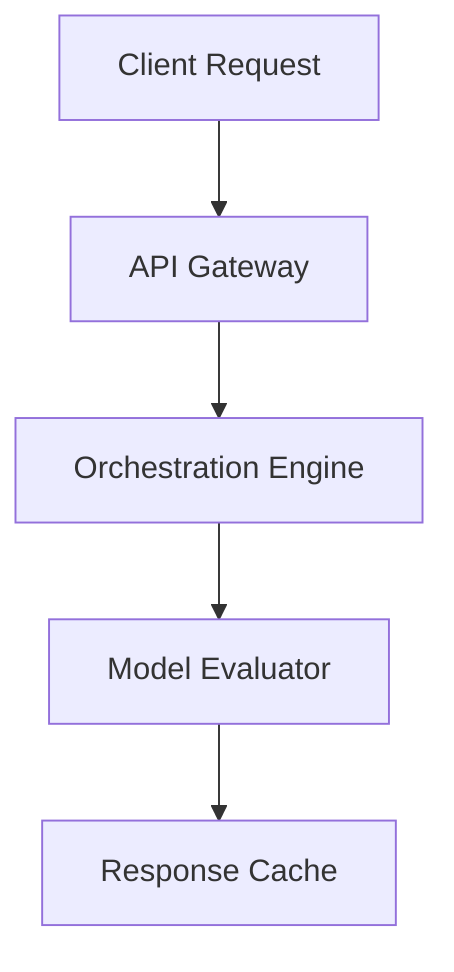

# Semantic Workflow Service Next

An open-source semantic workflow service next providing developer-friendly interfaces for ai agents workflows.

[](https://opensource.org/licenses/MIT)
[](#tech-stack)
[](#contributing)

## Features
- **Support for multi-agent cooperative workflows and parallel tasks**
- **Dynamic prompt templating, state tracking, and long-term memory management**
- **Built-in state machine for execution tracking and recovery**
- **Cross-Platform**: Built on top of modern cross-platform technologies (Go 1.22, gRPC, Protocol Buffers, Zap Logger).

## Tech Stack
- Go 1.22
- gRPC
- Protocol Buffers
- Zap Logger

## Quick Start

```bash
# Clone the repository
git clone https://github.com/example/semantic-workflow-service-next.git

# Setup and run
go mod tidy
go run main.go
```

## Architecture Diagram (Mermaid)


## Contributing
We welcome contributions! Please open an issue or submit a pull request for any improvements.

## License
This project is licensed under the MIT License - see the LICENSE file for details.
